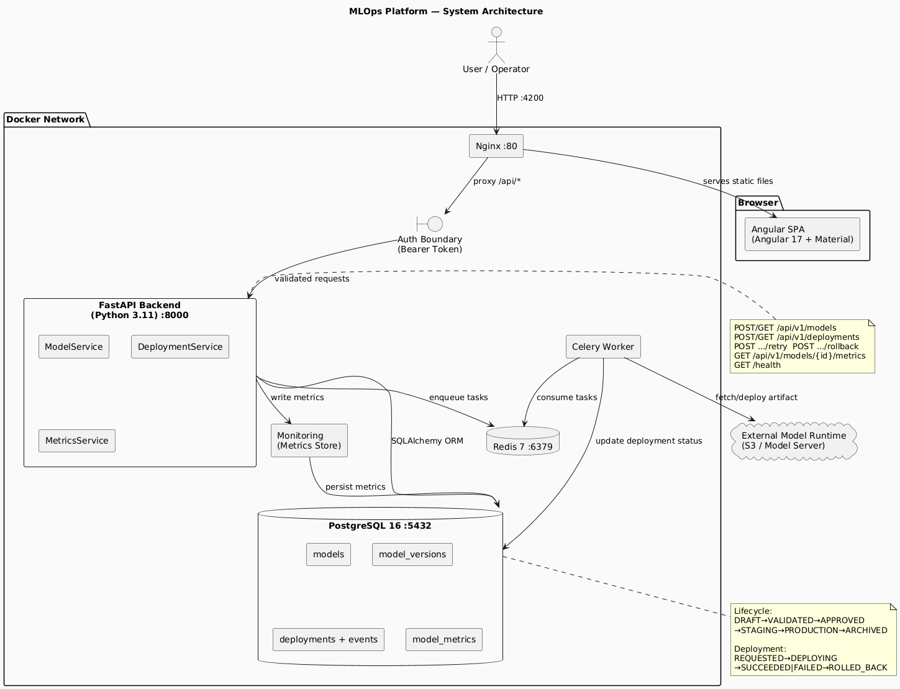
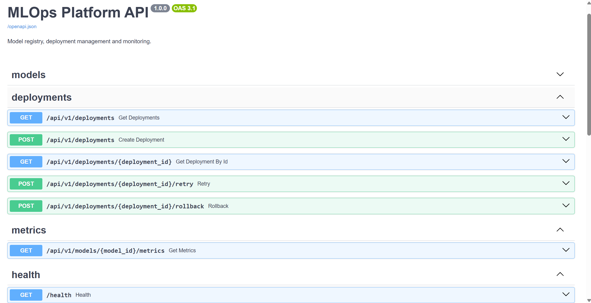

# MLOps Platform Technical Assignment

**Role Level:** G13

## Problem Statement
A scalable MLOps platform for managing machine learning model lifecycle including training, deployment, monitoring, and versioning.

## Architecture Diagram


## Architecture Summary
- **Backend:** FastAPI (Python) REST API
- **Frontend:** Angular SPA
- **Database:** PostgreSQL
- **Queue/Worker:** Celery + Redis
- **Containerization:** Docker + Docker Compose

## Technology Stack
| Layer | Technology |
|-------|-----------|
| Backend | Python, FastAPI |
| Frontend | Angular |
| Database | PostgreSQL |
| Queue | Redis + Celery |
| CI/CD | GitHub Actions |

## Setup & Run

```bash
cp .env.example .env
docker compose up --build
```

## Test Commands

```bash
make test-backend
make test-frontend
```

## API Documentation
See [docs/api-design.md](docs/api-design.md). Interactive docs available at `http://localhost:8000/docs` when running.

## Screenshots


## Service URLs
| Service | URL |
|---------|-----|
| Backend API | http://localhost:8000 |
| Frontend | http://localhost:4200 |
| API Docs (Swagger) | http://localhost:8000/docs |

## Sample Workflows
_See `data/` for sample data and `scripts/` for workflow scripts._

## Known Limitations
See [docs/known-limitations.md](docs/known-limitations.md).

## Future Improvements
- Model A/B testing
- Advanced monitoring dashboards
- Multi-cloud deployment support
